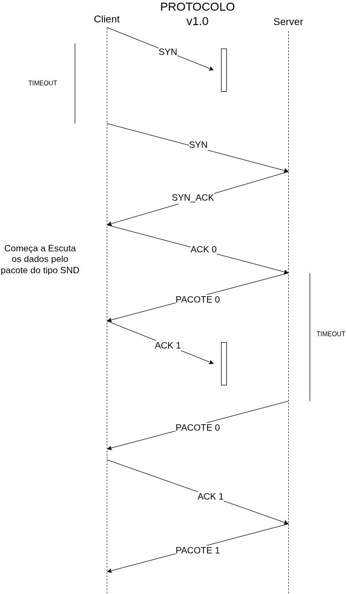

# TRABALHO 1 - Implementação de Transferência de Arquivos Confiável sobre UDP com Sockets

## Objetivo do Projeto:

Desenvolver uma aplicação cliente-servidor para transferência de arquivos utilizando o protocolo UDP. O foco principal é a implementação de mecanismos básicos de controle e confiabilidade diretamente sobre UDP, simulando funcionalidades que o TCP oferece nativamente.

## Como executar o trabalho:

## Requisitos Gerais:

- Linguagem C
    - Desvantagem de usar C:
        - Não tem funcionalidade de tratamento de erros em um nível de abstração equivalente ao mecanismo **try/except** presente em linguagens como Python
    - Vantagem de usar C:
        - uma linguagem que tem um desempenho melhor em relação as outras.
- Bibliotecas utilizadas para comunicação via socket:
    - sys/socket.h => socket()
    - netinet/in.h => struct sockaddr_in
    - unistd.h     => close()

## Requisitos do Servidor UDP:

## Design do Protocolo:

### Diagrama do fluxo de transmissão do protocolo

Meu protocolo tem algumas diferenças com TCP.Primeira dela em vez do ack representa o proximo Byte da requisição do cliente que nem TCP.O meu protocolo tem o ACK como indice do pacote que o cliente quer receber.Isso garante que os dados enviados cheguem corretamente ao destino.

### Segmentação e Tamanho do Buffer:
Como será o arquivo?

Pacote de dados é dividido em 2 partes:

    - Header(16B)
        - sequência do número do pacote(4B)
        - ACK(4B)
        - FLAGS para saber o tipo de pacote recebido(4B)
        - LENGTH = tamanho do vetor de dados(4B)
    - Payload(1008B)
        - char[1008]

##### Qual o tamanho máximo de dados por datagrama UDP?

**Resposta:** Seria máximo MTU do caminho para chegar ao Cliente menos o cabeçalho do UDP que é 8 bytes.
Tamanho PAYLOAD do meu protocolo é de 1008 Bytes e adicionei 16 Bytes de cabeçalho.

##### Este tamanho deve ser fixo ou variável?Como ele se relaciona com o MTU (Maximum Transmission Unit) da rede?

**Resposta:** Deve ser variável para que dados com tamanhos não multiplos ao PAYLOAD dos pacotes sejam transferidos, porém deve ser limitado que no máximo tenha o mínimo MTU entre as duas máquinas que estão se comunicando.Na verdade é limitado ao menor MTU de todas as máquinas que estão no caminho do envio da informação, caso encontre PAYLOAD maior que MTU de uma máquina o pacote é fragmentando em outros pacotes menores.

##### Os buffers de envio (servidor) e recepção (cliente) precisam ter tamanhos relacionados?

**Resposta:** Deve ter tamanho relacionado aos pacotes transmitido, mas cada dependerá de quanto de memoria que a aplicação e hardware da máquina têm.

### Detecção de Erros:

#### Como a integridade dos dados em cada segmento será verificada

**Resposta:** No proprio Datagram têm checksum no seu cabeçalho e antes do pacote chegar até o processo faz essa verificação.

#### É necessário implementar um checksum?

**Resposta** Não, como respondido na resposta anterior.O checksum esta presente no cabeçalho do UDP e antes da informação chegar até ao cliente ele

#### Qual algoritmo usar? 

**Resposta:** Não foi implementado nenhum algoritmo.Citarei alguns algoritmos pesquisados:
    - CRC (Cyclic Redundancy Check) = Usa divisão polinomial para detectar erros mais complexos.
    - HMAC (Hash-based Message Authentication Code) = Usa hash criptográfico com chave secreta.
    - Hashes (MD5, SHA) = Garante integridade de arquivos/dados.

### Ordenação e Detecção de Perda:

#### Como o cliente saberá a ordem correta dos segmentos? É necessário um número de sequência?

**Resposta:** Sim, foi necessario um número de sequência, porém em vez de fazer pelo ultimo byte eu decidir fazer pelo número de pacote enviado conforme o tamanho pacote padronizado pelo meu protocolo que é 1008B.
Por exemplo, um arquivo de 2500B enviará 3 pacotes do tipo SND
PACOTE 0: TAMANHO PAYLOAD 1008B | NÚMERO DE SEQUÊNCIA = 0
PACOTE 1: TAMANHO PAYLOAD 1008B | NÚMERO DE SEQUÊNCIA = 1 
PACOTE 2: TAMANHO PAYLOAD  484B | NÚMERO DE SEQUÊNCIA = 2
PACOTE 3: do tipo fim.

#### Como o cliente detectará que um segmento foi perdido (e não apenas atrasado)?

**Resposta:** Se um pacote foi perdido o cliente vai ignorar os pacotes enviados do servidor e enviar um ack com número de sequência do pacote que necessita.

## Referência das informações

https://www.cloudflare.com/pt-br/learning/network-layer/what-is-mtu/#:~:text=Em%20uma%20rede%2C%20a%20unidade,passagens%20sob%20rodovias%20ou%20t%C3%BAneis.