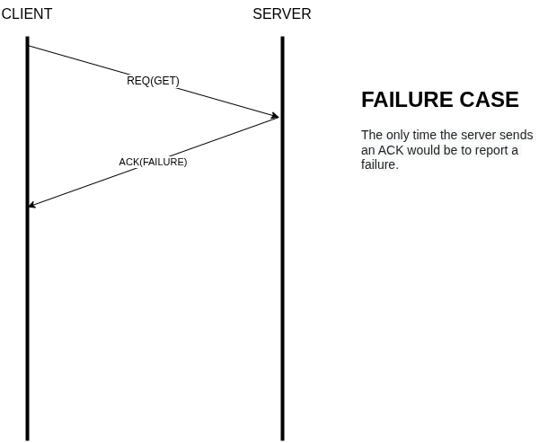
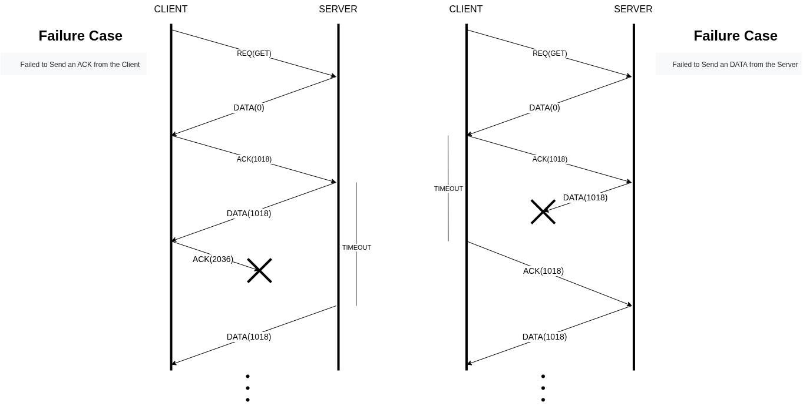
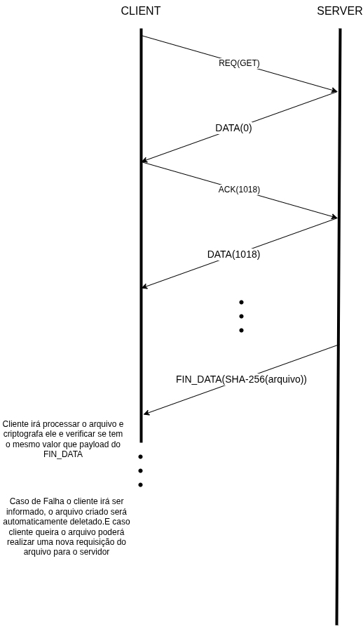
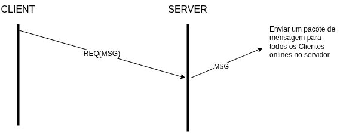

# Trabalho 2 - Implementação de Cliente/Servidor TCP Multithread com Transferência de Arquivos e Chat 

[link para repositório do github](https://github.com/Fabreu97/ICSR30)

## Objetivo do Projeto

Desenvolver uma aplicação cliente-servidor utilizando o protocolo TCP e programação de sockets. O servidor deve ser capaz de lidar com múltiplos clientes concorrentemente (usando threads) e oferecer funcionalidades como transferência de arquivos grandes com verificação de integridade (SHA) e um chat simples.

## Especificação de Requisitos:

### Requisitos Não Funcionais
- RNF01 - Linguagem de programação escolhida foi C++.  
- RNF02 - Utilização de sockets usando protocolo TCP.  
- RNF03 - O servidor terá multithreads para lidar com cada cliente.

### Requisitos Funcionais
- RF01 - O cliente pode se comunicar com os outros clientes logados no servidor via mensagem.  
- RF02 - O cliente poderá requisitar algum arquivo para servidor.  
- RF02.1 - O servidor deverá responder se o arquivo não existe.  
- RF02.2 - O servidor deverá começa a enviar o arquivo por pacotes.  
- RF02.3 - O servidor depois de enviar todos os pacotes do arquivo deverá verificar a integridade do arquivo enviado para o cliente  
- RF02.3.1 - O servidor deverá utilizar criptografia SHA-256 para verificar se o arquivo foi recebido e montado de forma correta.  
- RF03 - O cliente poderá sair da aplicação quando quiser.  

## Definição do Protocolo de Aplicação

### Material de Estudo Utilizado:

Para desenvolver a documentação do protocolo de aplicação deste projeto foi usado como exemplo o RFC do [HTTP/1.1](https://www.rfc-editor.org/rfc/rfc9112.txt).

### My Packet Transfer Protocol(MPTP)

#### Abstract

    O My Packet Transfer Protocol(MPTP) é um protocolo de nível de aplicação que 
    especifica a sintaxe da mensagem, como criar o pacote a ser enviado, a analise 
    do tipo de pacote, gerenciamento de conexões e a questão da verificação da  
    integridade do arquivo enviado. 

#### Table of Contents

- [1. Introdução](#1.-introducao)
- [2. Pacotes](#2-pacotes)
- [3. Mensagem](#3-mensagem)
- [4. Verificacao de Integridade](#4-verificacao-de-integridade)

#### 1. Introdução

    O My Packet Transfer Protocol(MPTP) é protocolo de resquest/response em nível de 
    aplicação com mensagens autodescritivas.

 

    Este documento especifica como a semântica MPTP é transmitida usando mecanismos 
    de sintaxe de mensagem, os tipos de pacotes que são enviados tanto pelo cliente,
    tanto pelo servidor e como faz a verificação de integridade de arquivos enviados
    pelo servidor.

#### 2. Pacotes

O protocolo define sete tipos distintos de pacotes: REQ, DATA, MSG, ACK, FIN_DATA, FIN e FIN_ACK. Cada tipo de pacote possui uma função específica na comunicação entre os nós da rede.

Todos os pacotes têm tamanho fixo de 1024 bytes (1 KB), sendo:

- 7 bytes reservados para o cabeçalho, que contém informações de controle (como tipo de pacote, sequência, etc.);

- 1017 bytes destinados ao campo de payload, utilizado para a carga útil da mensagem.

O uso de tamanho fixo simplifica o processamento e a validação dos pacotes em trânsito.

##### 2.1 Cabeçalho

O cabeçalho possui 7 bytes de comprimento e contém os seguintes campos:

- number (4 bytes, unsigned int): identifica o número de sequência do pacote ou referencia o número de um pacote anterior, no caso de pacotes do tipo ACK. Este campo é utilizado para controle de ordem e confirmação de entrega.

- flag (1 byte, char): indica o tipo do pacote. Os valores possíveis são: REQ, DATA, MSG, ACK, FIN e FIN_ACK. Este campo determina como o pacote deve ser interpretado pelo receptor.

- length (2 bytes, unsigned short int): especifica o tamanho, em bytes, dos dados úteis contidos no campo de payload. Esse valor pode variar até o máximo de 1017 bytes, respeitando o tamanho total fixo de 1 KB por pacote.

Cada campo do cabeçalho é posicionado em sequência e deve ser interpretado na ordem descrita acima.

##### 2.2 Payload

O payload é o conteúdo da mensagem transmitida em um pacote. Ele é utilizado apenas em quatro tipos de pacotes: REQ, DATA, MSG e FIN_DATA.

###### 2.2.1 Pacote REQ

No caso do pacote REQ, ele é enviado exclusivamente pelo cliente para o servidor com o objetivo de fazer uma requisição. O conteúdo do payload, nesse caso, varia conforme o tipo de requisição:

- MSG/mensagem — Envia uma mensagem para outro usuário.

- GET/nome_do_arquivo.extensão — Solicita um arquivo ao servidor.

- IDT/nome_do_usuario — Identifica o cliente com um nome de usuário visível aos demais.

###### 2.2.2 Pacote DATA

O pacote DATA é gerado pelo servidor e enviado a um cliente que solicitou um arquivo por meio de um pacote REQ. O payload deste pacote é preenchido com uma porção dos bytes do arquivo requisitado, correspondente à posição indicada pelo campo ACK do cliente. Essa fragmentação permite a transferência segmentada e controlada do arquivo.

###### 2.2.3 Pacote MSG

O pacote MSG é criado pelo servidor sempre que recebe um pacote REQ com um payload no formato MSG/mensagem. Ao receber essa requisição, o servidor propaga o conteúdo para todos os outros clientes conectados, utilizando um pacote MSG com o seguinte formato de payload:
NOME_DO_CLIENTE/mensagem.

Esse campo identifica o autor da mensagem e seu conteúdo. Limitações quanto ao tamanho do nome de usuário e da mensagem serão definidas em versões futuras deste protocolo.

###### 2.2.4 Pacote FIN_DATA

Pacote FIN_DATA
O pacote FIN_DATA é enviado pelo servidor ao cliente que requisitou um arquivo, após o envio completo de todos os pacotes DATA. O payload deste pacote contém 256 bits (32 bytes) correspondentes ao hash SHA-256 do arquivo transferido. Esse hash permite ao cliente verificar a integridade do arquivo recebido e marca oficialmente o fim da transferência.

#### 3. Mensagem

3.1 Fluxo de Mensagens

3.1.1 Fluxo de Requisição de Arquivo

Caso de falha se o arquivo não existe: 

Caso de falha se um pacote não receber no tempo esperado: 

Caso quando todos os bytes de um arquivo já foram enviados para o cliente o servidor manda pacote de FIN_DATA com o arquivo criptografado com SHA-256 para o cliente como payload do pacote 

3.1.2 Fluxo de Requisição de Mensagem:

